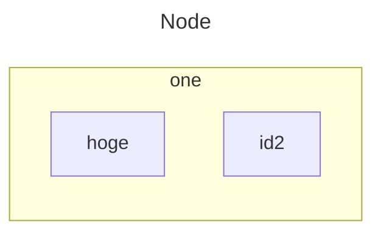

# hanataba
モデリング課題「花束問題」をやってみる  
[NPO法人 IT勉強宴会 - 花束問題V1.2](https://www.benkyoenkai.org/contents/Bouquet1-2)

```mermaid
---
title: Node
---
flowchart LR
subgraph one
id
end
subgraph one
id2
end

id["hoge"]
  
```